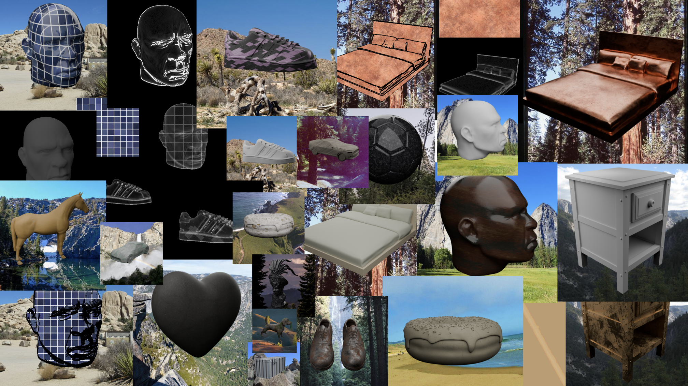
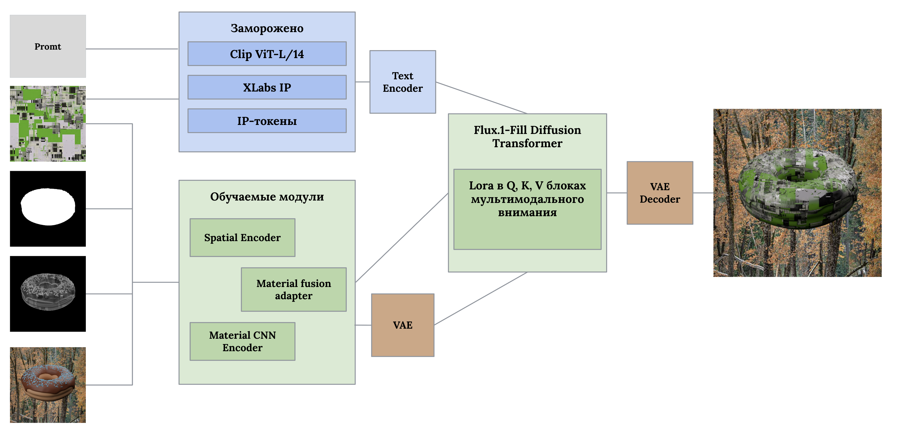

# Генеративное редактирование материалов объектов на основе диффузионных моделей  

  

**Автор:** Панченко Василий Игоревич  
**Научный руководитель:** Аланов Айбек  
**Куратор:** Гарифуллин Камиль Зуфарович  

---

#### Постановка задачи

Цель проекта — дообучить LoRA-адаптер для диффузионной модели **Flux‑Fill** так, чтобы она научилась редактировать материалы трёхмерных объектов на изображениях с сохранением:

- геометрии сцены,
- направления освещения,
- физической достоверности результата.

---

#### Формат входных и выходных данных

- **Разрешение всех изображений** — 512×512 пикселей.
- **Вход модели** — двумерное изображение с подчёркнутыми контурами (edge‑enhanced), а также маска объекта (**mask**) и карта границ (**edges**).
- **Выход модели** — отрендеренное в Blender изображение с наложенным целевым материалом.

**Статистика датасета**:

| Набор           | Уникальные объекты | Материалы | Ракурсы | Всего примеров |
|----------------|--------------------|-----------|---------|----------------|
| Тренировочный  | 32                 | 50        | 10      | ≈16 000        |
| Валидационный  | 6                 | 25        | 10      | ≈1 500         |
| Бенчмарк       | 6                 | 25        | 10      | ≈1 500         |

> **Важно:** все три сета содержат **непересекающиеся** модели и материалы – объект или материал из тренировки не встречаются ни в валидации, ни в бенчмарке.  
> **Общее для всех сетов:** на вход подаётся изображение с выделенными границами, а также маска и edges; выходом служит рендер Blender с новым материалом.

Датасет, использованный в экспериментах, доступен на Hugging Face: [Vasyliy/MatRender](https://huggingface.co/datasets/Vasyliy/MatRender).

---

#### Метрики и функция потерь

Оптимизация модели выполняется через **комбинированную функцию потерь**, объединяющую несколько компонентов.

##### Компоненты функции потерь

| Компонент | Обозначение | Назначение | Вес |
|-----------|-------------|------------|-----|
| Диффузионная потеря (MSE) | `loss_sd` | Стандартная потеря для диффузионных моделей – минимизирует среднеквадратичную ошибку между предсказанным и истинным шумом/скоростью в латентном пространстве. | 1.0 |
| Маскированная потеря | `loss_mask` | MSE, взвешенная маской объекта – штрафует ошибки только в области редактирования (наложения материала). Увеличивает внимание модели к целевой зоне. | 2.0 |
| Перцептуальная потеря (LPIPS) | `loss_lpips` | Оценивает различие между сгенерированным и целевым изображением на уровне восприятия человека. Использует предобученную сеть VGG. Способствует сохранению текстуры и деталей. | 1.0 |
| Спектральная потеря (FFT) | `loss_fft` | Штрафует несовпадение высокочастотных компонент (амплитуд Фурье) между предсказанным и реальным изображениями. Игнорирует низкие частоты (освещение, цветовые пятна) и фокусируется на резких перепадах, краях и мелких узорах. | 0.1 |

##### Итоговая функция потерь

```
Loss = loss_sd + 2.0 * loss_mask + 1.0 * loss_lpips + 0.1 * loss_fft 
```

Все компоненты оптимизируются совместно.

##### Отслеживаемые метрики

В процессе обучения логируются:

- `train/loss` – полное значение потерь (сглаженное экспоненциально).
- `train/loss_sd` – диффузионная компонента.
- `train/loss_mask` – маскированная компонента.
- `train/loss_lpips` – перцептуальная компонента.
- `train/loss_fft` – спектральная компонента.
- `train/t` – средний временной шаг диффузии (от 0 до 1).
- `val/lpips` – значение LPIPS на фиксированном валидационном батче (вычисляется один раз в `val_every_n_steps` шагов).

##### Визуализация результатов

Каждые `val_every_n_steps` шагов модель генерирует изображения для 16 фиксированных семплов валидации. В TensorBoard и в папку `val_images` сохраняется сетка из пяти столбцов:

1. **Материал** (basecolor)
2. **Контуры** (edges)
3. **Входное изображение** (оригинал с фоном)
4. **Предсказание модели** (результат)
5. **Целевой рендер** (ground truth)

Это позволяет наглядно отслеживать прогресс обучения и качество переноса материалов.

---

#### Архитектура модели

Модель построена на основе **FluxFillPipeline** и использует **трёхкомпонентное кондиционирование** (multi‑path conditioning). Это позволяет разделить глобальный стиль, локальные узоры и пространственную геометрию, что существенно повышает качество переноса материала.

#### Основные обучаемые компоненты

| Компонент | Функция |
|-----------|---------|
| **Spatial encoder** | Извлекает пространственные признаки из `edges` и `mask` (размер выхода 32×32). |
| **MaterialCNNEncoder** | Обрабатывает текстуру материала (basecolor), возвращает глобальный вектор (FiLM) и патч‑токены (1024 токена) для cross‑attention. |
| **MaterialFusionAdapter** | Выполняет cross‑attention между пространственными токенами и патч‑токенами материала, затем применяет FiLM для глобального стиля. Два последовательных блока attention + FFN. |
| **MaterialResidualEncoder** | Проецирует материал в пространство VAE‑латентов (16 каналов, разрешение H/8×W/8) и добавляет residual к `x_t` до входного трансформера. Последний слой инициализирован нулями (starts from zero). |
| **CondProj** | Лениво инициализируемый проектор для объединённого кондишена (`cond_latents + cond_masked_latents`). |
| **IP‑Adapter** (заморожен) | Извлекает семантический стиль материала через CLIP vision encoder (XLabs). |

#### Замороженные модули

- **Flux transformer** (основная диффузионная модель)
- **CLIP vision encoder** (`openai/clip-vit-large-patch14`)
- **VAE** Flux (encode/decode)
- **Текстовые энкодеры** Flux

Обучаются только LoRA и перечисленные выше адаптеры (≈233 млн параметров).

#### Схема подачи материала

 

Такая декомпозиция позволяет модели одновременно учитывать:

- общий визуальный стиль (через IP‑Adapter),
- локальную структуру (через cross‑attention),
- точные высокочастотные узоры (через residual injection).

---

#### Базовые эксперименты (бейзлайны)

1. **Восстановление фотографий** – прямое восстановление показало низкую реалистичность и проблемы с тенями на объектах.
2. **Наложение материала по градиентам Собеля** – материал накладывался только вдоль контуров, не растягивался по объёму, результат выглядел плоским и не учитывал перспективу.

Разработанная архитектура преодолевает эти ограничения за счёт комбинирования пространственных и семантических сигналов.

---

#### Аппаратное обеспечение и производительность

- **GPU:** NVIDIA A100‑SXM4‑80GB  
- **Trainable параметры:** ~235 млн (LoRA + адаптеры)  
- **Non‑trainable параметры:** ~13.7 млрд (замороженные Flux transformer, CLIP, VAE, IP‑адаптер)  
- **Общий объём модели:** ~13.9 млрд параметров (~55,8 ГБ)  
- **Размер батча:** 4 (эффективный батч с аккумуляцией градиентов = 16)  
- **Оптимизатор:** Prodigy (адаптивная скорость обучения)  

> Детальное распределение параметров по модулям (из логов Lightning):

| Компонент | Тип | Параметры |
|-----------|-----|-----------|
| transformer | FluxTransformer2DModel | 13.6 B |
| ip_processors | ModuleList | 1.4 B |
| ip_image_encoder | CLIPVisionModelWithProjection | 303 M |
| ip_proj_in | Linear | 50.4 M |
| material_cnn_encoder | MaterialCNNEncoder | 2.3 M |
| material_fusion_adapter | MaterialFusionAdapter | 562 K |
| material_res_encoder | MaterialResidualEncoder | 436 K |
| spatial_cond_encoder | Sequential | 177 K |
| lpips_fn | VGG‑based LPIPS | 14.7 M |
| (остальные) | LayerNorm и пр. | ~8 K |

Все обучаемые модули (LoRA и перечисленные адаптеры) дают **235 M** параметров, остальные – заморожены.
В проекте использовался  python 3.10.18.

--- 

<!-- **Репозиторий с чекпоинтами:** (https://)   -->
**Датасет:** [Vasyliy/MatRender](https://huggingface.co/datasets/Vasyliy/MatRender)
